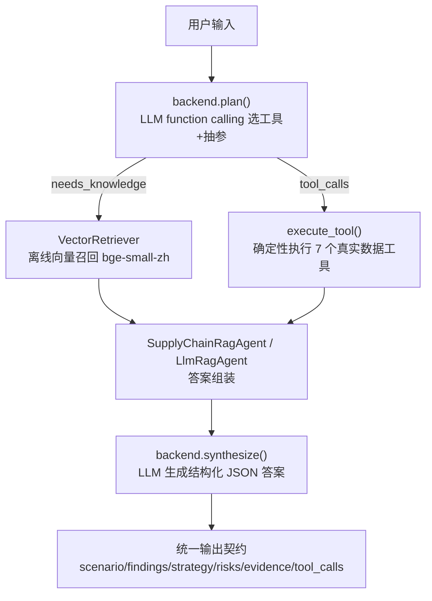

# 真·LLM 版 RAG Agent 设计说明

## 0. 与关键词版的关系

本文档是 [`rag-agent-portfolio`](https://github.com/579lqy/rag-agent-portfolio)（关键词版）的升级重写说明。
关键词版的完整设计见其 `docs/04`，本版**只替换三处"智能"发生地**，确定性底座（工具/数据/知识/评测）原样复用。

关键词版的三处"伪智能"：

| 文件 | 旧实现 | 本质 |
|---|---|---|
| `intent_router.py` | 三张关键词表命中路由 | 规则，非 LLM |
| `rag_agent.py::LocalRetriever` | TF-IDF 字符匹配 + 同义词补丁 | 规则，非 LLM |
| `rag_agent.py::_rag/_tool/_hybrid_answer` | 填空模板 | 规则，非 LLM |

本版对应替换为：`llm_backend.OpenAIBackend.plan`（function calling 路由/抽参）、
`vector_retriever.VectorRetriever`（语义向量召回）、`llm_backend.OpenAIBackend.synthesize`（LLM 生成）。

## 1. 设计目标（与关键词版一致）

1. 判断用户输入该用什么方式回答（**现在由 LLM 判断**）。
2. 涉及方法论/公式/SOP，从本地知识库语义检索（**现在用向量检索**）。
3. 涉及具体数值，调用数据工具查真实数据，**不让模型生成或臆测**。
4. 输出结构化、可解释、带依据来源的策略建议。

## 2. 整体架构（LLM 版）



双后端：`RuleBasedBackend`（复用 `keyword_router`，零依赖兜底）与 `OpenAIBackend`（真 LLM）。
任一 LLM 环节失败回退 `RuleBasedBackend`。

## 3. LLM 插入点一：路由 + 工具调度（取代关键词路由 + 正则派发）

`mcp_tools.tool_manifest()` 已定义 7 个工具的 schema，本版直接把它转成 OpenAI function-calling schema
（`llm_backend.manifest_to_openai_tools`），喂给 LLM：

```python
resp = client.chat.completions.create(
    model=model, messages=[...], tools=manifest_to_openai_tools(manifest),
    tool_choice="auto", temperature=0)
# -> [{"name": "low_stock_skus", "arguments": {"location": "Mumbai", "top_n": 5}}]
```

执行层不变：`execute_tool(name, args)` 调 `mcp_tools` 同名函数，只传工具声明参数、并把返回规整为 dict。
LLM 决定调 0/1/多个工具，**天然覆盖 hybrid**，不再需要三路分类硬规则。

## 4. LLM 插入点二：向量检索（取代 TF-IDF）

`VectorRetriever` 优先 `sentence-transformers` 本地 `BGE-small-zh`（中文、512 维、可离线），
不可用时回退 `LocalRetriever`（TF-IDF）。`search()` 接口与旧版一致，`rag_agent` 零改动。
纯 Python 余弦相似度，不强制依赖 numpy。

## 5. LLM 插入点三：答案合成（取代模板填空）

把召回 `contexts` + 工具 `tool_results` 塞进 prompt，要求严格 JSON 输出，解析后填入统一契约，
`format_answer()` 与前端零改动：

```python
system = "基于【知识】和【数据】回答，不得编造。输出 JSON {scenario,findings,strategy,risks}"
resp = client.chat.completions.create(..., response_format={"type":"json_object"})
```

## 6. 工具层（与关键词版完全相同，不动）

7 个真实数据工具见 `mcp_tools.py`：`find_sku / low_stock_skus / supplier_defect_ranking /
avg_lead_time_by_location / lead_time_stats / abc_classification / supplier_scorecard`。
所有数值直接查 `clean_supply_chain.csv` 真实行。

## 7. 输出契约（与关键词版一致，前端零改动）

`scenario / findings / strategy / risks / evidence / tool_calls` 六段，统一可解释结构。

## 8. ADR 摘要（相对关键词版的变化）

| 决策 | 关键词版 | LLM 版 | 为什么 |
|---|---|---|---|
| 意图路由 | 关键词规则（90.5%） | LLM function calling | 语义理解覆盖表述变体，无需维护关键词表 |
| 检索 | TF-IDF | 离线向量（bge）+ TF-IDF 回退 | 语义召回质量更高、更稳 |
| 答案合成 | 填空模板 | LLM 生成 JSON | 自然语言组织能力，仍带结构化约束防幻觉 |
| 兜底 | 无 | RuleBasedBackend 双后端 | 没 key / LLM 失败仍可用，保留零依赖故事 |
| 评测 | intent/recall/e2e | 新增 tool_call_accuracy + faithfulness + 成本 | 测"模型能力"而非"规则本身" |

## 9. 扩展方向

- 检索：向量 + rerank；在线 embedding 备选。
- 路由：held-out 评测集防过拟合；多轮对话记忆。
- 工具：本地 CSV → 数据库/MCP 真实服务；扩展 `replenishment_strategy` 等业务语义工具。
- 评测：更大规模 + 自动黄金标注抽检 + CI 回归门禁（rulebased 基线 + openai 新指标双门禁）。
